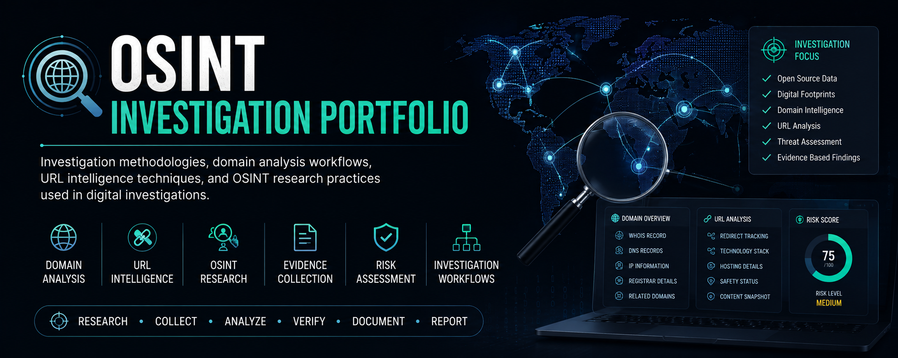

# OSINT Investigation Portfolio

  

  <strong>Domain Intelligence • URL Analysis • Digital Investigations • Research Methodologies</strong>

---

## Overview

This repository showcases investigation methodologies, analytical frameworks, and documentation practices commonly used in Open Source Intelligence (OSINT) investigations.

The portfolio focuses on structured approaches for collecting, validating, analyzing, and documenting publicly available information to support digital investigations and intelligence gathering activities.

---

## Areas Covered

### Domain Intelligence

Investigation techniques for understanding domain ownership patterns, infrastructure relationships, registration information, and associated technical indicators.

### URL Analysis

Methodologies for evaluating URL behavior, redirection chains, content accessibility, and potential risk indicators.

### Open Source Intelligence (OSINT)

Frameworks for collecting, validating, and analyzing publicly available information from multiple sources while maintaining investigation integrity and documentation standards.

### Evidence Collection

Structured approaches for capturing, organizing, and documenting investigation findings to ensure traceability and consistency.

### Investigation Documentation

Reporting standards, verification procedures, and documentation practices designed to support professional investigative workflows.

---

## Repository Structure

### Investigation Methodologies

* Domain Investigation Workflow
* URL Analysis Framework
* WHOIS Research Methodology
* DNS Analysis Guide
* Evidence Collection Standards
* Verification Process

### Research Frameworks

* OSINT Investigation Lifecycle
* Investigation Planning Methodology
* Information Validation Process

### Case Studies

* Domain Investigation Case Study
* URL Analysis Case Study

### Documentation Standards

* Investigation Notes
* Evidence Records
* Analysis Reports
* Research Summaries

---

## Investigation Lifecycle

The methodologies presented in this repository follow a structured investigation process:

1. Define Objectives
2. Collect Information
3. Validate Sources
4. Analyze Findings
5. Document Evidence
6. Report Results

This approach promotes consistency, traceability, and accuracy throughout the investigation process.

---

## Skills Demonstrated

* Open Source Intelligence (OSINT)
* Digital Investigations
* Domain Analysis
* URL Analysis
* DNS Research
* WHOIS Analysis
* Evidence Collection
* Research Methodology
* Documentation Standards
* Risk Assessment
* Analytical Thinking
* Investigation Reporting

---

## Purpose

The objective of this repository is to demonstrate professional investigation methodologies, analytical approaches, and documentation practices that can be applied across various digital investigation and intelligence-gathering scenarios.

---

## Disclaimer

This repository is intended for educational and professional portfolio purposes only.

No confidential information, proprietary systems, client data, or restricted investigation techniques are included. All examples are generalized to demonstrate investigation principles, documentation practices, and analytical methodologies.

---

## Author

**Shiv Mishra**

Digital Content Protection Analyst | OSINT Investigator | Anti-Piracy Operations Specialist

Interested in opportunities related to:

* OSINT Analysis
* Digital Investigations
* Content Protection
* Brand Protection
* Trust & Safety
* Intelligence Research
* Digital Risk Analysis
